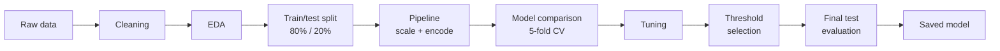
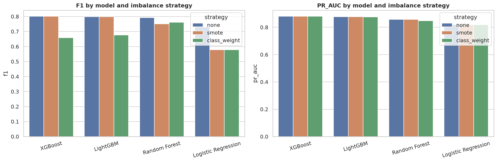
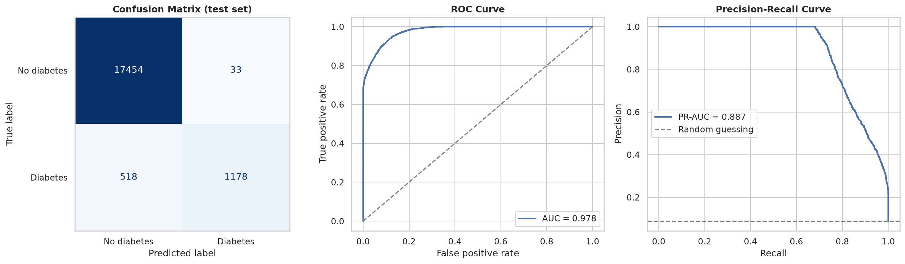
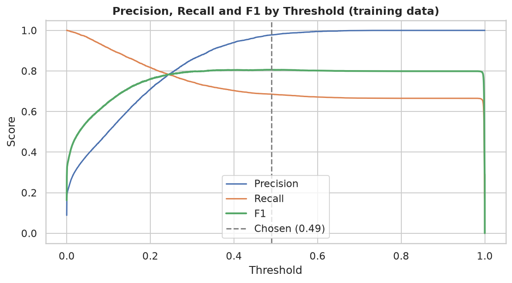
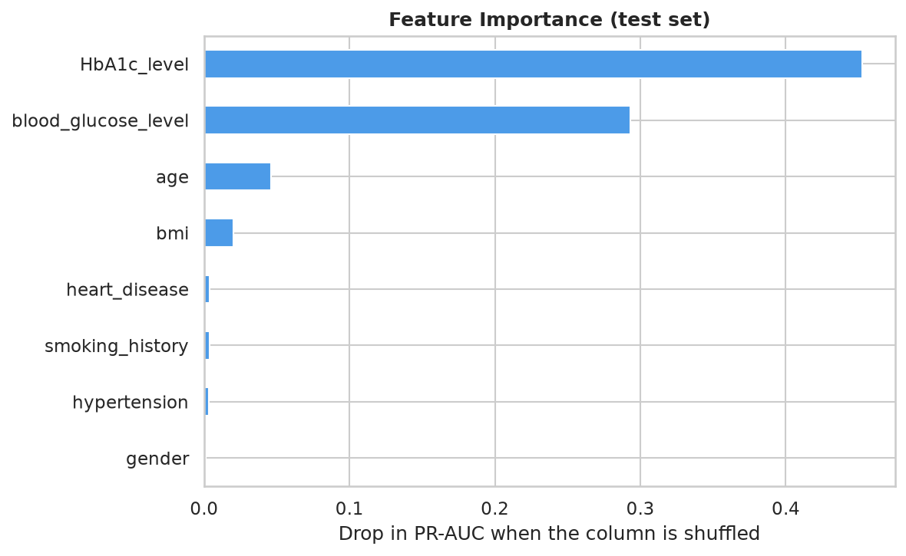

# Diabetes Prediction

**An end-to-end machine learning project: from raw clinical data to a validated, saved screening model.**


## Overview

This project predicts whether a patient has diabetes from eight routine clinical and demographic features. It covers the full workflow: data cleaning, exploratory analysis, leakage-free preprocessing, model comparison with cross-validation, hyperparameter tuning, decision threshold selection, a single final evaluation on held-out data, and a saved model ready for reuse.

Only about 8.8% of patients in the data are diabetic, so the project is built around the problems that come with an imbalanced medical dataset: the right metrics, the right resampling strategy, and an honest evaluation.

## Highlights

- **Leakage-free pipeline.** Scaling, encoding and oversampling are fitted inside each cross-validation fold, so no information from validation or test data reaches training.
- **Imbalance handled and compared.** No correction, class weights and SMOTE are tested for every model.
- **Four models compared.** Logistic Regression, Random Forest, XGBoost and LightGBM, against a random-guessing baseline.
- **Metrics that fit the problem.** Models are selected by PR-AUC, and results are reported with recall, precision and F1. Accuracy is not used for selection, because predicting "no diabetes" for everyone already scores about 91%.
- **Tuned decision threshold.** The cutoff is chosen on cross-validated training predictions, not on the test set.
- **One-time test evaluation.** The 20% test set is touched once, at the very end.
- **Reusable artifact.** The full pipeline and its threshold are saved together in one file.

## Table of Contents

- [Dataset](#dataset)
- [Methodology](#methodology)
- [Results](#results)
- [Key Findings from the EDA](#key-findings-from-the-eda)
- [Project Structure](#project-structure)
- [Getting Started](#getting-started)
- [Using the Saved Model](#using-the-saved-model)
- [Limitations](#limitations)
- [Contributors](#contributors)
- [Acknowledgements](#acknowledgements)

## Dataset

**Source:** [Diabetes Prediction Dataset on Kaggle](https://www.kaggle.com/datasets/iammustafatz/diabetes-prediction-dataset)

| Feature | Type | Description |
|---|---|---|
| `gender` | Categorical | Female or Male |
| `age` | Numeric | Age in years |
| `hypertension` | Binary | 0 = no, 1 = yes |
| `heart_disease` | Binary | 0 = no, 1 = yes |
| `smoking_history` | Categorical | never, former, current, not current, ever, No Info |
| `bmi` | Numeric | Body mass index |
| `HbA1c_level` | Numeric | Average blood sugar over about 3 months (%) |
| `blood_glucose_level` | Numeric | Blood glucose (mg/dL) |
| `diabetes` | Target | 0 = no diabetes, 1 = diabetes |

**After cleaning:** 95,914 records and 9 columns, with no missing values and no duplicate rows. Of these, 8,480 patients (8.8%) are diabetic, a class ratio of roughly 10 to 1.

Cleaning removed duplicate records, the small number of `Other` gender entries, and implausible smoking records for young children. Outliers were examined and kept.

The EDA notebook explored an extended version of the data with engineered features (category bands, interaction terms and risk flags). The models in this project learn from the eight cleaned features listed above.

## Methodology



1. **Cleaning.** Duplicates, invalid categories and implausible records are removed.
2. **Exploratory analysis.** Distributions, risk factors, correlations and clinical thresholds are examined.
3. **Split.** A stratified 80/20 train/test split keeps the diabetic ratio identical in both sets.
4. **Preprocessing.** Numeric features are scaled, text categories are one-hot encoded, and binary columns pass through unchanged.
5. **Model comparison.** Four models are evaluated under three imbalance strategies using stratified 5-fold cross-validation on the training set only.
6. **Tuning.** A randomised search optimises the best model for PR-AUC.
7. **Threshold selection.** The cutoff that maximises F1 is chosen from out-of-fold predictions.
8. **Final evaluation.** The tuned model is scored once on the held-out test set.
9. **Explanation and export.** Permutation importance shows which features drive predictions, and the complete pipeline is saved.

## Results

### Model comparison (5-fold cross-validation, training set)



The full table is in [`reports/model_comparison.csv`](reports/model_comparison.csv).

### Final performance (held-out test set)

| Setting | Recall | Precision | F1 | ROC-AUC | PR-AUC |
|---|---|---|---|---|---|
| Selected model, tuned cutoff | __ | __ | __ | __ | __ |

**Selected model:** __ with __ (chosen by cross-validated PR-AUC).

The values come from [`reports/final_results.csv`](reports/final_results.csv).



### Threshold selection



### What drives the predictions



## Key Findings from the EDA

- **Class imbalance:** about 8.8% of records are diabetic, so resampling or class weights are required.
- **Strongest signals:** HbA1c level and blood glucose level, followed by age and BMI.
- **Age:** the diabetes rate rises sharply after age 50, and the 60+ group has the highest prevalence.
- **Cardiovascular conditions:** patients with both hypertension and heart disease show an elevated rate.
- **BMI:** the obesity category has the highest diabetes rate.
- **Clinical thresholds:** in this data, every patient with HbA1c above 6.6% or blood glucose above 200 mg/dL is diabetic.
- **Smoking:** former and ever smokers show slightly higher rates than never smokers.
- **Gender:** little difference overall.

## Project Structure

```
machineLearningAssignment/
├── data/                  # raw and cleaned datasets
├── notebooks/
│   ├── Cleaning/          # cleaning.ipynb
│   ├── Domain-knowledge/  # clinical background and thresholds
│   ├── EDA/               # eda.ipynb
│   ├── Modeling/          # modeling.ipynb (split, pipeline, model comparison)
│   └── Evaluation/        # evaluation.ipynb (tuning, threshold, test, saved model)
├── images/                # charts exported from the notebooks
├── models/                # saved model (best_model.pkl)
├── reports/               # result tables (CSV)
├── src/                   # Python scripts
├── requirements.txt       # pinned dependencies
└── README.md
```

## Getting Started

**1. Clone the repository**

```bash
git clone https://github.com/tracymuhoozi/machineLearningAssignment.git
cd machineLearningAssignment
```

**2. Create a virtual environment and install dependencies**

```bash
python3 -m venv venv
source venv/bin/activate
pip install -r requirements.txt
```

On Ubuntu or WSL, LightGBM also needs the OpenMP library:

```bash
sudo apt install -y libgomp1
```

**3. Add the data**

Download the dataset from the Kaggle link above and place it in `data/`. Running the cleaning notebook produces `data/cleaned_1.csv`.

**4. Run the notebooks in order**

| Step | Notebook | Output |
|---|---|---|
| 1 | `notebooks/Cleaning/cleaning.ipynb` | `data/cleaned_1.csv` |
| 2 | `notebooks/EDA/eda.ipynb` | EDA charts in `images/` |
| 3 | `notebooks/Modeling/modeling.ipynb` | `reports/model_comparison.csv` |
| 4 | `notebooks/Evaluation/evaluation.ipynb` | `models/best_model.pkl`, `reports/final_results.csv` |

Open each notebook in VS Code (with the Python and Jupyter extensions) or in Jupyter, select the `venv` kernel, and choose **Run All**. The evaluation notebook rebuilds the same train/test split as the modelling notebook, so the two always agree.

## Using the Saved Model

After running the evaluation notebook, the saved file contains the full pipeline (preprocessing and model), the chosen decision threshold and the expected feature names.

```python
import joblib
import pandas as pd

artifact = joblib.load('models/best_model.pkl')

patient = pd.DataFrame([{
    'gender': 'Female', 'age': 54.0, 'hypertension': 0, 'heart_disease': 0,
    'smoking_history': 'never', 'bmi': 27.3,
    'HbA1c_level': 6.8, 'blood_glucose_level': 160,
}])[artifact['features']]

risk = artifact['pipeline'].predict_proba(patient)[0, 1]
label = 'Diabetic' if risk >= artifact['threshold'] else 'Not diabetic'
print(f'Predicted risk: {risk:.2f}  ->  {label}')
```

The model file must be loaded with the same library versions listed in `requirements.txt`.

## Limitations

- **Rule-like labels.** In this dataset the diabetes label follows clear thresholds on HbA1c and blood glucose. Scores are therefore likely higher than they would be on real patient data, and results should not be read as clinical accuracy.
- **Not a diagnostic tool.** The model is a screening aid built for coursework. It must not replace laboratory tests or a clinician's judgement.
- **Limited feature set.** Only eight features are used, with no family history, diet, medication or activity data.
- **Single dataset.** The model has not been validated on an external population.

## Contributors

- [@Alouzious](https://github.com/Alouzious)
- [@Tracie-1](https://github.com/Tracie-1)
- [@Trilly-1](https://github.com/Trilly-1)
- [@Cosmas357](https://github.com/Cosmas357)
- [@ahurira3](https://github.com/ahurira3)
- [@wakhabekoe-eng](https://github.com/wakhabekoe-eng)
- [@mugishaalex5461-max] (https://github.com/mugishaalex5461-max)

## Acknowledgements

Dataset provided on Kaggle by Mohammed Mustafa (iammustafatz). Please check the Kaggle page for the license terms.