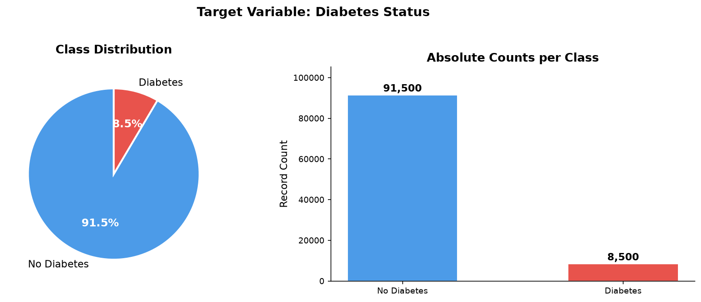
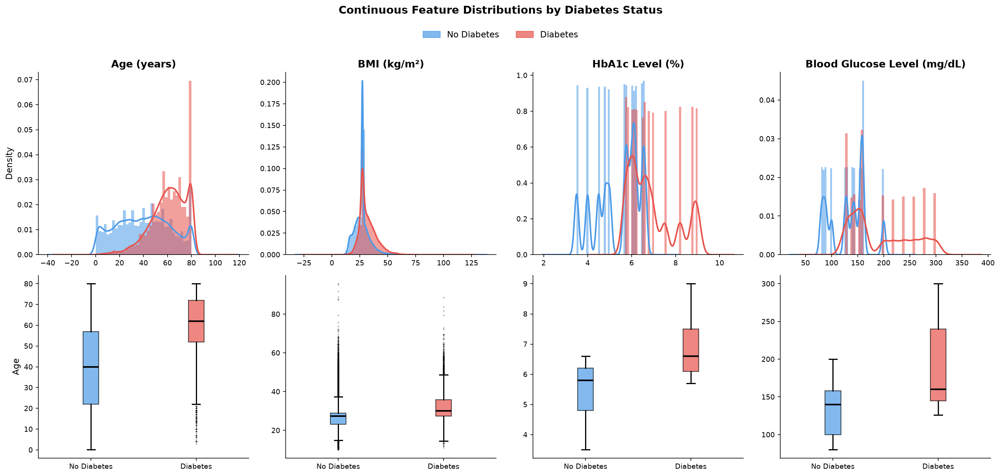
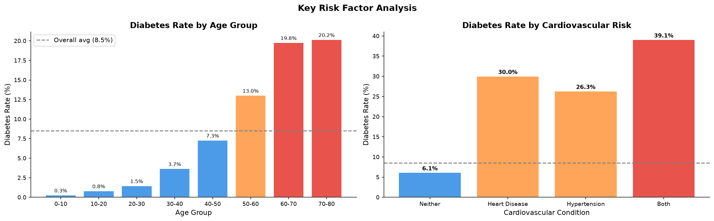
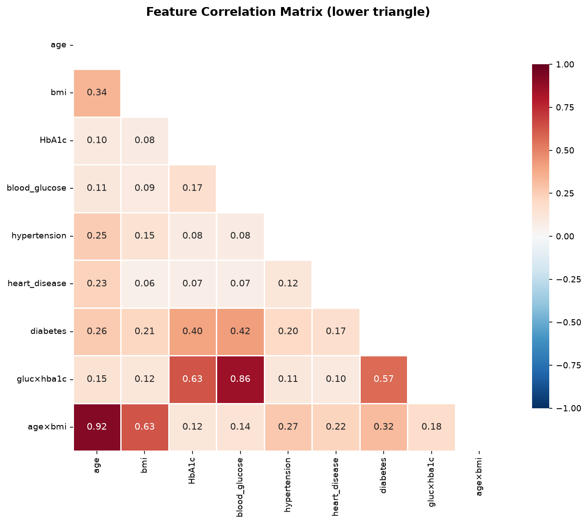
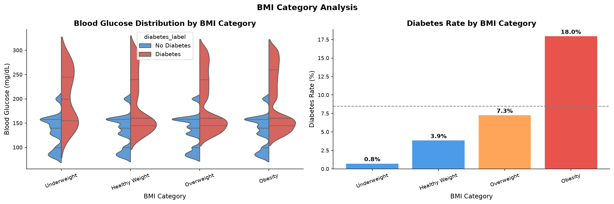

# Diabetes Prediction: Exploratory Data Analysis

Exploratory data analysis (EDA) of a diabetes dataset, looking at which clinical
factors are linked to a diabetes diagnosis and what this means for modelling.

## Table of Contents

- [Project Structure](#project-structure)
- [Dataset](#dataset)
- [Key Findings](#key-findings)
- [Selected Charts](#selected-charts)
- [How to Run](#how-to-run)
- [Tools](#tools)
- [Acknowledgements](#acknowledgements)

## Project Structure

```
machineLearningAssignment/
├── data/              # dataset in (CSV)
├── notebooks/         # eda.ipynb
├── images/            # charts exported from the notebook
├── reports/           # written report
├── src/               # Python scripts
├── requirements.txt   # Python dependencies
└── README.md
```

## Dataset

**Source:** [Diabetes Prediction Dataset on Kaggle](https://www.kaggle.com/datasets/iammustafatz/diabetes-prediction-dataset)

| Feature | Description |
|---|---|
| `gender` | Patient gender |
| `age` | Age in years |
| `hypertension` | 0 = no, 1 = yes |
| `heart_disease` | 0 = no, 1 = yes |
| `smoking_history` | Smoking status category |
| `bmi` | Body mass index |
| `HbA1c_level` | Average blood sugar level over about 3 months (%) |
| `blood_glucose_level` | Blood glucose (mg/dL) |
| `diabetes` | Target: 0 = no diabetes, 1 = diabetes |

The notebook uses a transformed version of this data with extra engineered
columns: category bands (HbA1c, BMI, blood glucose), interaction terms and
binary risk flags.

To reproduce the analysis, download the CSV from Kaggle and place it in the
`data/` folder.

## Key Findings

- **Class imbalance:** about 8.8% of records are diabetic, so techniques such as
  SMOTE or class weights are needed when modelling.
- **Strongest predictors:** HbA1c level and blood glucose level, followed by age
  and BMI.
- **Age:** the diabetes rate rises sharply after age 50, and the 60+ group has
  the highest prevalence.
- **Cardiovascular conditions:** patients with both hypertension and heart
  disease show an elevated diabetes rate.
- **BMI:** the obesity category has the highest diabetes rate.
- **Clinical thresholds:** a high HbA1c combined with a high blood glucose level
  points strongly to diabetes.
- **Smoking:** former and ever smokers show slightly higher rates than never
  smokers.
- **Engineered features:** the glucose x HbA1c interaction separates the two
  classes clearly and should help tree-based models.
- **Gender:** little difference overall, with males slightly higher in older age
  groups.

## Selected Charts

### Class distribution


### Continuous feature distributions


### Diabetes rate by risk profile


### Correlation heatmap


### BMI category analysis


## How to Run

**1. Clone the repository**

```bash
git clone git@github.com:tracymuhoozi/machineLearningAssignment.git
cd machineLearningAssignment
```

**2. Create a virtual environment and install dependencies**

```bash
python3 -m venv venv
source venv/bin/activate
pip install -r requirements.txt
```

**3. Add the dataset**

Download the CSV from the Kaggle link above and place it in the `data/` folder.

**4. Open the notebook**

Open `notebooks/eda.ipynb` in VS Code (with the Python and Jupyter extensions)
or in Jupyter, select the `venv` kernel, then run all cells.

## Tools

- Python 3
- pandas
- NumPy
- Matplotlib
- Seaborn
- SciPy
- Jupyter

## Acknowledgements

Dataset provided on Kaggle by Mohammed Mustafa (iammustafatz). Please check the
Kaggle page for the author name and license terms.


I put the next step in its own folder as a separate, self-contained notebook. I ran all of its cells end to end on stand-in data with your column layout, once with XGBoost and once with Random Forest as the chosen model, and they ran without errors.

## Folder

```
notebooks/
├── Modeling/modeling.ipynb          (stops at Cell 11, the model comparison)
└── Evaluation/evaluation.ipynb      <- new folder and new file
```

```bash
cd ~/machineLearningAssignment
mkdir -p notebooks/Evaluation
```

In VS Code, right-click `Evaluation`, choose **New File**, name it `evaluation.ipynb`, and select the `venv` kernel. If you already pasted the extra cells into `modeling.ipynb`, delete them from there.

## Before you start

Run `modeling.ipynb` first. Its last cell saves `reports/model_comparison.csv`, and this notebook reads that file to pick the best model. The new notebook also rebuilds the same 80/20 split. It uses the same `random_state=42`, so the test rows are exactly the same as before. Cell 4 prints the shapes, and with your real data they should be **Train (76731, 8)** and **Test (19183, 8)**.

---

## Cell 1 (Markdown)

```markdown
# Diabetes Prediction: Model Validation and Saving

Starting from the model comparison in `modeling.ipynb`, this notebook:
1. Rebuilds the same train/test split
2. Selects the best model from the cross-validation results
3. Tunes its hyperparameters (training data only)
4. Chooses the decision threshold (training data only)
5. Evaluates once on the held-out test set
6. Explains the model with feature importance
7. Saves the final model
```

## Cell 2 (Code)

```python
# Import libraries
import os
import warnings
import joblib
import numpy as np
import pandas as pd
import matplotlib.pyplot as plt
import seaborn as sns

from sklearn.model_selection import (train_test_split, StratifiedKFold, RandomizedSearchCV,
                                     cross_val_predict, ParameterGrid)
from sklearn.compose import ColumnTransformer
from sklearn.preprocessing import StandardScaler, OneHotEncoder
from sklearn.pipeline import Pipeline
from sklearn.linear_model import LogisticRegression
from sklearn.ensemble import RandomForestClassifier
from sklearn.metrics import (precision_recall_curve, roc_curve, confusion_matrix,
                             ConfusionMatrixDisplay, recall_score, precision_score,
                             f1_score, roc_auc_score, average_precision_score,
                             accuracy_score, classification_report)
from sklearn.inspection import permutation_importance
from xgboost import XGBClassifier
from lightgbm import LGBMClassifier
from imblearn.pipeline import Pipeline as ImbPipeline
from imblearn.over_sampling import SMOTE

warnings.filterwarnings('ignore')
sns.set_theme(style='whitegrid')

RANDOM_STATE = 42
os.makedirs('../../images', exist_ok=True)
os.makedirs('../../reports', exist_ok=True)
os.makedirs('../../models', exist_ok=True)

print('Libraries loaded ✓')
```

## Cell 3 (Markdown)

```markdown
## 1. Load Data and Recreate the Split
```

## Cell 4 (Code)

```python
# Load the cleaned dataset
DATA_PATH = '../../data/cleaned_1.csv'
TARGET = 'diabetes'

df = pd.read_csv(DATA_PATH)

X = df.drop(columns=TARGET)
y = df[TARGET]

# Same split settings as modeling.ipynb (same random_state), so the training
# and test sets are exactly the same rows as before
X_train, X_test, y_train, y_test = train_test_split(
    X, y, test_size=0.20, stratify=y, random_state=RANDOM_STATE
)

print(f'Train: {X_train.shape}  Test: {X_test.shape}')
print(f'Diabetic rate  train: {y_train.mean():.3f}  test: {y_test.mean():.3f}')
```

## Cell 5 (Code)

```python
# Column groups (from the cleaned dataset)
NUM_COLS = ['age', 'bmi', 'HbA1c_level', 'blood_glucose_level']
BIN_COLS = ['hypertension', 'heart_disease']
CAT_COLS = ['gender', 'smoking_history']

assert set(NUM_COLS + BIN_COLS + CAT_COLS) == set(X_train.columns), 'Column mismatch'

# Scale numbers, one-hot encode text, keep 0/1 columns as they are
preprocessor = ColumnTransformer([
    ('num', StandardScaler(), NUM_COLS),
    ('cat', OneHotEncoder(handle_unknown='ignore', sparse_output=False), CAT_COLS),
    ('bin', 'passthrough', BIN_COLS),
])

# Cross-validation: 5 folds, class ratio kept in every fold
cv = StratifiedKFold(n_splits=5, shuffle=True, random_state=RANDOM_STATE)

# Ratio of negatives to positives, used by XGBoost
pos_weight = (y_train == 0).sum() / (y_train == 1).sum()


def make_models(strategy):
    """Return the four models configured for the given imbalance strategy."""
    cw = 'balanced' if strategy == 'class_weight' else None
    spw = pos_weight if strategy == 'class_weight' else 1
    return {
        'Logistic Regression': LogisticRegression(max_iter=1000, class_weight=cw),
        'Random Forest': RandomForestClassifier(n_estimators=200, class_weight=cw,
                                                random_state=RANDOM_STATE),
        'XGBoost': XGBClassifier(n_estimators=300, learning_rate=0.1, scale_pos_weight=spw,
                                 eval_metric='logloss', random_state=RANDOM_STATE),
        'LightGBM': LGBMClassifier(n_estimators=300, class_weight=cw,
                                   random_state=RANDOM_STATE, verbose=-1),
    }


def build_pipeline(model, strategy):
    """Preprocessing (and SMOTE if chosen) are refit inside every CV fold."""
    if strategy == 'smote':
        return ImbPipeline([('prep', preprocessor),
                            ('smote', SMOTE(random_state=RANDOM_STATE)),
                            ('model', model)])
    return Pipeline([('prep', preprocessor), ('model', model)])
```

## Cell 6 (Markdown)

```markdown
## 2. Select the Best Model

The best model is chosen from the cross-validation results (training set only)
using PR-AUC. The test set has not been used so far.
```

## Cell 7 (Code)

```python
# Read the comparison table saved by modeling.ipynb
RESULTS_PATH = '../../reports/model_comparison.csv'
assert os.path.exists(RESULTS_PATH), 'Run modeling.ipynb first so model_comparison.csv exists'

results_df = pd.read_csv(RESULTS_PATH)

# Rank all real models by PR-AUC (the baseline is excluded)
candidates = (results_df[results_df['model'] != 'Dummy (baseline)']
              .sort_values('pr_auc', ascending=False)
              .reset_index(drop=True))
print('Top 3 by PR-AUC (cross-validation on the training set):')
display(candidates.head(3))

best_row = candidates.iloc[0]
BEST_MODEL_NAME = best_row['model']
BEST_STRATEGY = best_row['strategy']

# To choose a different row yourself, uncomment and edit these two lines:
# BEST_MODEL_NAME, BEST_STRATEGY = 'XGBoost', 'none'

print(f"\nSelected: {BEST_MODEL_NAME} with strategy '{BEST_STRATEGY}'")
```

## Cell 8 (Markdown)

```markdown
## 3. Hyperparameter Tuning

A random search tries 15 different settings of the selected model using
5-fold cross-validation on the training set, and keeps the best one.
```

## Cell 9 (Code)

```python
# Settings to search for each model
param_grids = {
    'Logistic Regression': {'model__C': [0.01, 0.1, 1, 10, 100]},
    'Random Forest': {'model__n_estimators': [200, 400],
                      'model__max_depth': [None, 10, 20],
                      'model__min_samples_leaf': [1, 2, 5]},
    'XGBoost': {'model__n_estimators': [200, 400, 600],
                'model__max_depth': [3, 4, 6],
                'model__learning_rate': [0.03, 0.05, 0.1],
                'model__subsample': [0.8, 1.0],
                'model__colsample_bytree': [0.8, 1.0]},
    'LightGBM': {'model__n_estimators': [200, 400, 600],
                 'model__num_leaves': [15, 31, 63],
                 'model__learning_rate': [0.03, 0.05, 0.1],
                 'model__min_child_samples': [20, 50, 100]},
}

grid = param_grids[BEST_MODEL_NAME]
n_iter = min(15, len(ParameterGrid(grid)))

best_pipeline = build_pipeline(make_models(BEST_STRATEGY)[BEST_MODEL_NAME], BEST_STRATEGY)

# This can take 5 to 15 minutes
search = RandomizedSearchCV(best_pipeline, grid, n_iter=n_iter,
                            scoring='average_precision', cv=cv,
                            n_jobs=-1, random_state=RANDOM_STATE, verbose=1)
search.fit(X_train, y_train)

print('Best settings :', search.best_params_)
print(f"PR-AUC before tuning: {best_row['pr_auc']:.3f}")
print(f'PR-AUC after tuning : {search.best_score_:.3f}')

# The best pipeline, already refit on the full training set
final_pipeline = search.best_estimator_
```

## Cell 10 (Markdown)

```markdown
## 4. Decision Threshold

By default a patient is called diabetic when the predicted probability is at
least 0.5. Here the cutoff is chosen using cross-validated predictions on the
training set, so the test set stays untouched. The chosen cutoff maximises F1.
```

## Cell 11 (Code)

```python
# Out-of-fold probabilities: each training row is predicted by a model that never saw it
oof_proba = cross_val_predict(final_pipeline, X_train, y_train, cv=cv,
                              method='predict_proba', n_jobs=-1)[:, 1]

prec, rec, thr = precision_recall_curve(y_train, oof_proba)
f1_curve = 2 * prec[:-1] * rec[:-1] / (prec[:-1] + rec[:-1] + 1e-12)

# Cutoff with the best F1
best_threshold = float(thr[f1_curve.argmax()])

# Alternative for screening: the highest cutoff that still keeps 90% recall
# best_threshold = float(thr[np.where(rec[:-1] >= 0.90)[0].max()])

print(f'Chosen threshold: {best_threshold:.3f}  (default is 0.5)')

plt.figure(figsize=(8, 4.5))
plt.plot(thr, prec[:-1], label='Precision')
plt.plot(thr, rec[:-1], label='Recall')
plt.plot(thr, f1_curve, label='F1', linewidth=2)
plt.axvline(best_threshold, color='gray', linestyle='--', label=f'Chosen ({best_threshold:.2f})')
plt.xlabel('Threshold')
plt.ylabel('Score')
plt.title('Precision, Recall and F1 by Threshold (training data)', fontweight='bold')
plt.legend()
plt.tight_layout()
plt.savefig('../../images/threshold_tuning.png', dpi=150, bbox_inches='tight')
plt.show()
```

## Cell 12 (Markdown)

```markdown
## 5. Final Evaluation on the Test Set

The 20% test set is used here for the first and only time.
```

## Cell 13 (Code)

```python
# Predicted probabilities on the held-out test set
test_proba = final_pipeline.predict_proba(X_test)[:, 1]


def score(name, threshold):
    """Scores at a given cutoff."""
    pred = (test_proba >= threshold).astype(int)
    return {'setting': name, 'threshold': round(threshold, 3),
            'recall': recall_score(y_test, pred),
            'precision': precision_score(y_test, pred),
            'f1': f1_score(y_test, pred),
            'accuracy': accuracy_score(y_test, pred)}


final_results = pd.DataFrame([score('Default cutoff', 0.5),
                              score('Tuned cutoff', best_threshold)]).round(3)
display(final_results)

test_roc = roc_auc_score(y_test, test_proba)
test_pr = average_precision_score(y_test, test_proba)
print(f'ROC-AUC: {test_roc:.3f}   PR-AUC: {test_pr:.3f}')
print(f'PR-AUC in cross-validation was {search.best_score_:.3f}. '
      'A small gap means the model is not overfitted.')

y_pred = (test_proba >= best_threshold).astype(int)
print('\nClassification report (tuned cutoff):')
print(classification_report(y_test, y_pred, target_names=['No diabetes', 'Diabetes']))
```

## Cell 14 (Code)

```python
fig, axes = plt.subplots(1, 3, figsize=(17, 5))

# Confusion matrix
ConfusionMatrixDisplay(confusion_matrix(y_test, y_pred),
                       display_labels=['No diabetes', 'Diabetes']).plot(
    ax=axes[0], cmap='Blues', colorbar=False)
axes[0].grid(False)
axes[0].set_title('Confusion Matrix (test set)', fontweight='bold')

# ROC curve
fpr, tpr, _ = roc_curve(y_test, test_proba)
axes[1].plot(fpr, tpr, linewidth=2, label=f'AUC = {test_roc:.3f}')
axes[1].plot([0, 1], [0, 1], '--', color='gray')
axes[1].set_xlabel('False positive rate')
axes[1].set_ylabel('True positive rate')
axes[1].set_title('ROC Curve', fontweight='bold')
axes[1].legend()

# Precision-recall curve
p_curve, r_curve, _ = precision_recall_curve(y_test, test_proba)
axes[2].plot(r_curve, p_curve, linewidth=2, label=f'PR-AUC = {test_pr:.3f}')
axes[2].axhline(y_test.mean(), linestyle='--', color='gray', label='Random guessing')
axes[2].set_xlabel('Recall')
axes[2].set_ylabel('Precision')
axes[2].set_title('Precision-Recall Curve', fontweight='bold')
axes[2].legend()

plt.tight_layout()
plt.savefig('../../images/final_evaluation.png', dpi=150, bbox_inches='tight')
plt.show()
```

## Cell 15 (Markdown)

```markdown
## 6. Feature Importance

Permutation importance shuffles one column at a time and measures how much
the PR-AUC drops. A large drop means the model relies on that column.
```

## Cell 16 (Code)

```python
perm = permutation_importance(final_pipeline, X_test, y_test,
                              scoring='average_precision', n_repeats=5,
                              random_state=RANDOM_STATE, n_jobs=-1)

importance = pd.Series(perm.importances_mean, index=X_test.columns).sort_values()

plt.figure(figsize=(8, 5))
importance.plot.barh(color='#4C9BE8')
plt.xlabel('Drop in PR-AUC when the column is shuffled')
plt.title('Feature Importance (test set)', fontweight='bold')
plt.tight_layout()
plt.savefig('../../images/feature_importance.png', dpi=150, bbox_inches='tight')
plt.show()
```

## Cell 17 (Markdown)

```markdown
## 7. Save the Model
```

## Cell 18 (Code)

```python
# Save the full pipeline (preprocessing + model) with its chosen cutoff
artifact = {
    'pipeline': final_pipeline,
    'threshold': best_threshold,
    'features': list(X_train.columns),
    'model_name': BEST_MODEL_NAME,
    'strategy': BEST_STRATEGY,
}
joblib.dump(artifact, '../../models/best_model.pkl')

# Save the final scores for the report
final_results.to_csv('../../reports/final_results.csv', index=False)

size_mb = os.path.getsize('../../models/best_model.pkl') / 1e6
print(f'Saved models/best_model.pkl ({size_mb:.1f} MB)')

# Test: reload the model and predict for a new patient
loaded = joblib.load('../../models/best_model.pkl')
new_patient = pd.DataFrame([{
    'gender': 'Female', 'age': 54.0, 'hypertension': 0, 'heart_disease': 0,
    'smoking_history': 'never', 'bmi': 27.3,
    'HbA1c_level': 6.8, 'blood_glucose_level': 160,
}])[loaded['features']]

risk = loaded['pipeline'].predict_proba(new_patient)[0, 1]
label = 'Diabetic' if risk >= loaded['threshold'] else 'Not diabetic'
print(f'Predicted risk: {risk:.2f}  ->  {label}')
```

## Cell 19 (Markdown)

Fill in the numbers after you see your output:

```markdown
## 8. Conclusions

- **Best model:** (model name) with (strategy), chosen by PR-AUC in cross-validation.
- **Tuning:** PR-AUC moved from (before) to (after).
- **Test performance:** recall (x), precision (x), F1 (x), ROC-AUC (x).
- **Generalisation:** test PR-AUC is close to the cross-validation PR-AUC, so the model is not overfitted.
- **Main drivers:** HbA1c level and blood glucose level (see feature importance).
- **Limitation:** the diabetes label follows clear thresholds on HbA1c and glucose,
  so scores are likely higher than they would be on real patients.
- **Use:** this is a screening aid, not a diagnosis.
```

---

## Before pushing

1. Click **Restart**, then **Run All**, and confirm there are no red errors.
2. Save the notebook so the outputs show on GitHub.
3. Check the model file size printed by Cell 18. GitHub rejects files above 100 MB, and a large Random Forest can get big. If it is above about 50 MB, keep it out of Git:

```bash
echo "models/*.pkl" >> .gitignore
```

4. Push:

```bash
pip freeze > requirements.txt
git add .
git commit -m "Add evaluation notebook: tuning, final test and saved model"
git push
```

Paste the `final_results` table and the classification report here when it finishes. I'll help you write the conclusions and the README results section from your real numbers.